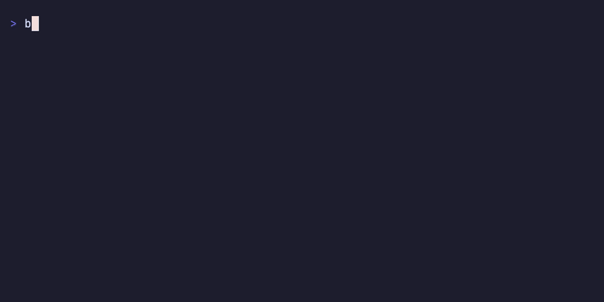

# bs

[](https://github.com/sounak98/betterstack-cli/actions/workflows/ci.yml)
[](https://github.com/sounak98/betterstack-cli/releases)
[](LICENSE)

Fast, AI-friendly CLI for [Better Stack](https://betterstack.com). Built for humans, scripts, and AI agents.

<p align="center">
  
</p>

## Why a CLI?

Better Stack already has an [MCP server](https://betterstack.com/docs/getting-started/integrations/mcp/). So why build a CLI?

**Works everywhere, not just MCP clients.** Every AI coding tool can run shell commands: Claude Code, Cursor, Windsurf, Aider, Copilot. A CLI needs zero integration setup. MCP servers need per-client configuration that you repeat for every editor.

**No context window bloat.** MCP servers dump their full tool schema into the agent's context. The [GitHub MCP server costs ~55k tokens](https://github.com/modelcontextprotocol/modelcontextprotocol/issues/1576) before a single question is asked. A CLI returns only the data you asked for, and agents can filter it further with pipes.

**Composable.** Chain `bs` with `jq`, `grep`, `gh`, `kubectl`, or any other tool:

```sh
bs monitors list -o json | jq '.[] | select(.Status == "down") | .Name'
```

MCP servers are isolated. They can't pipe into each other.

**Works in CI/CD.** Drop `bs` into any pipeline with an env var. MCP servers have no CI story.

**No intermediary.** `bs` talks directly to the Better Stack API with a token stored locally in `~/.config/bs/`. MCP servers route through a hosted intermediary with OAuth, adding a dependency and a point of failure.

**Open source, single binary.** `curl | sh` to install. No runtime, no Docker, no OAuth flow.

**Useful for humans too.** MCP is exclusively an AI-to-AI interface. `bs` works just as well in your terminal.

## Install

**Shell (macOS / Linux):**

```sh
curl -fsSL https://raw.githubusercontent.com/sounak98/betterstack-cli/main/install.sh | sh
```

**From source:**

```sh
cargo install --git https://github.com/sounak98/betterstack-cli
```

**Self-update:**

```sh
bs upgrade
```

## Setup

```sh
bs auth init
```

Get your API tokens at [betterstack.com/settings/api-tokens](https://betterstack.com/settings/api-tokens/0). For log querying, you'll also need ClickHouse SQL credentials from [Connect remotely](https://betterstack.com/docs/logs/query-api/connect-remotely/#getting-started) or ask your Better Stack admin.

## Usage

### Logs

```sh
bs logs tail --source 12345                          # Live tail (like kubectl logs -f)
bs logs tail --source 12345 --query 'level = ERROR'  # Tail with filter
bs logs tail --source 12345 -o json | jq '.message'  # Pipe to jq
bs logs query 'level = ERROR AND status >= 500' --source 12345 --since 1h
```

Queries use the [Better Stack Live Tail query language](https://betterstack.com/docs/logs/using-logtail/live-tail-query-language/).

### Monitors

```sh
bs monitors list                        # List all monitors
bs monitors list --status down          # Filter by status
bs monitors get 12345                   # Get monitor details
bs monitors create --url https://example.com --name "My Site"
```

### Incidents

```sh
bs incidents list --status started
bs incidents ack 12345
bs incidents resolve 12345
```

### Output formats

Every command supports `-o json` for piping to `jq`, AI tools, or scripts:

```sh
bs monitors list -o json | jq '.[] | select(.Status == "down")'
bs logs tail --source 12345 -o json | jq '.level, .message'
```

## Configuration

Config is stored at `~/.config/bs/config.toml`.

| Flag / Env | Description |
|---|---|
| `--token` / `BETTERSTACK_UPTIME_TOKEN` | Uptime API token |
| `--team` / `BS_TEAM` | Team name (multi-team accounts) |
| `-o` / `BS_OUTPUT` | Output format: `table`, `json`, `csv` |
| `--no-color` / `NO_COLOR` | Disable colored output |
| `-q` / `--quiet` | Minimal output |

## Development

```sh
make check      # fmt + clippy + test
make build      # Debug build
make install    # Release build + install to ~/.local/bin
```

## License

MIT
